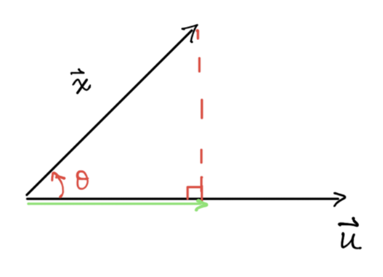

# **Principal Component Analysis**

## Introduction

Principal Component Analysis (PCA) is a dimension reduction approach. It's a very powerful tool for 

### Intuition

The goal of PCA is to represent high dimensional data with lower dimensions. Of course, we are going to lose some "information".

## Preliminaries

Before we start, we will quickly review some fundamental concepts that we need later on.

### Projections


<figure>
    
    <figcaption> Fig.1 Projection</figcaption>
</figure>

Projection of $\vec{x}$ onto $\vec{u}$ (green vector in fig.1)?

$$ \begin{aligned}
\lVert \vec{x} \rVert \cos\theta &= \frac{\lVert \vec{x} \rVert \lVert \vec{u} \rVert \cos\theta} {\lVert \vec{u} \rVert} \\
&= \frac{\vec{x}^\intercal \vec{u}}{\lVert \vec{u} \rVert}
\end{aligned}
$$


### Heading 3

$A \cup B$

<p align="center">

</p>


$$
\begin{bmatrix}
1 & 2 & 3 \\
4 & 5 & 6 \\
a & b & c
\end{bmatrix}
$$


```r
norm = function(x) {
  sqrt(x%*%x)
}
norm(1:4)
```